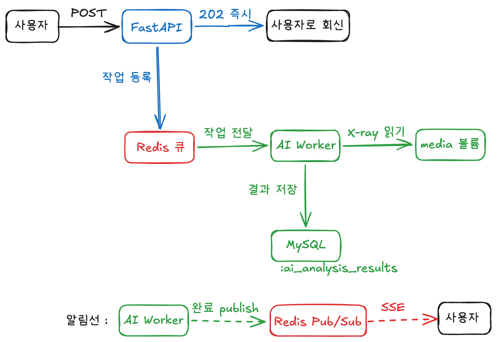

# 9일차 — 동시성 문제 해결을 위한 아키텍처 설계

> FastAPI + Redis 기반 **Event-Driven Architecture(이벤트 기반 아키텍처)** 설계 정리
> 주제: AI 폐렴 예측 서비스의 동시성 문제와, 비동기 작업 처리로 이를 해결하는 설계
> 대상: AI Health Web 프로젝트 (FastAPI 기반 흉부 X-ray 폐렴 예측 서비스, ConvNeXt+DenseNet OR 앙상블 모델)

---

## 0. TL;DR (3줄 요약)

1. AI 추론(X-ray → 폐렴 예측)은 무겁고 느린 작업이라, **요청 안에서 끝까지 기다리면(현재 `run_in_threadpool` 방식)** 요청이 몰릴 때 스레드풀이 포화되며 **동시성 문제**가 생긴다.
2. 해결책은 "요청을 받으면 **즉시 접수 응답(202)** 만 하고, 무거운 추론은 **별도 워커(worker)** 가 처리한 뒤, 클라이언트는 **결과를 조회(폴링)하거나 완료 시 SSE 푸시로 알림받는**"하는 비동기 구조다.
3. 이 구조의 핵심 부품이 **Redis(메시지 브로커 / 작업 대기열)** 이며, **최종 분석 결과는 기존처럼 MySQL `ai_analysis_results` 테이블에 영구저장(+캐싱)** 한다. 구현은 **Celery + Redis**(메인)와 **Redis Streams**(학습)로 나눈다.

---

## 1. 우리 프로젝트의 동시성 문제 (현재 구현 기준)

### 1-1. 현재 예측 흐름 (`app/services/ai_analysis_services.py`)

`POST /api/v1/medical-records/{record_id}/ai-analysis` → `predict_or_get_cached()`:

1. 진료기록 존재 확인 (404)
2. 대표 X-ray 1장 조회 (`media/xray/`의 파일 경로)
3. **캐싱 확인**: 같은 `(record_id, model_name)` 결과가 `ai_analysis_results`에 있으면 → 재추론 없이 즉시 반환 (200)
4. 캐시 없음 → X-ray 파일을 bytes로 읽어 **`run_in_threadpool(predict_pneumonia, image_bytes)`** 로 추론
5. 결과를 `ai_analysis_results`에 저장 → 201 반환

```python
# 현재(동기): 추론이 끝날 때까지 요청이 기다린다
result = await run_in_threadpool(predict_pneumonia, image_bytes)  # ← 몇 초 ~ 수십 초 블로킹
saved = await repo.create(db, ...)
return saved, True
```

### 1-2. `run_in_threadpool`은 절반의 해결일 뿐

`run_in_threadpool`은 추론을 **별도 스레드**에서 돌려 **이벤트 루프는 안 막지만**, 여전히:

- **요청(클라이언트)은 추론이 끝날 때까지 응답을 못 받는다.** (요청-응답 한 사이클에 묶임)
- 스레드풀 워커 수가 한정(기본 ~40)이라, **동시에 X-ray 예측이 몰리면 스레드풀이 포화** → 이후 요청들이 줄서서 대기.
- 모델 추론은 **CPU 바운드**라, 스레드를 늘려도 CPU 코어 수 이상으로는 빨라지지 않고 오히려 서로 경쟁한다.
- 캐싱은 **재요청**만 빠르게 할 뿐, **진료기록별 첫 예측**은 여전히 풀 블로킹이다.

### 1-3. NFR 위반 위험

- 비기능 요구 **"AI 예측 응답 지연 최소화(NFR-PRED-002)"** 를 정면으로 위협한다.
- 최악의 경우 추론이 몰리며 헬스체크/다른 API까지 응답이 느려진다.

> **핵심 인식**: AI 추론은 본질적으로 빠르게 끝난다고 보장할 수 없다. → **"요청 접수(응답)"와 "추론 처리"를 분리**해야 한다. `run_in_threadpool` 한 줄로는 부족하고, **작업 큐 + 별도 워커**가 필요하다.

---

## 2. 해결 아이디어 — 요청/처리의 분리와 이벤트 기반 아키텍처(EDA)

### 2-1. 동기 vs 비동기(이벤트 기반) 비교

| 구분 | 현재(동기, threadpool) | 비동기(이벤트 기반) |
|------|------------------------|----------------------|
| 응답 시점 | 추론이 끝난 뒤 (201/200) | **즉시** (보통 `202 Accepted`) |
| 무거운 작업 | API 프로세스가 직접 | **별도 워커**가 백그라운드에서 |
| 결과 전달 | 응답 본문에 바로 | **나중에 조회**(polling) |
| 동시 요청 | 스레드풀 포화 → 줄서기 | 큐에 쌓고 워커가 순차/병렬 소화 |
| 장애 시 | 요청 통째로 실패 | 작업이 큐에 남아 **재시도 가능** |

### 2-2. 이벤트 기반 아키텍처(EDA) 3요소

- **생산자(Producer)**: 이벤트(=해야 할 일)를 만들어 던지는 쪽 → **FastAPI 엔드포인트**
- **브로커(Broker)/큐(Queue)**: 이벤트를 잠시 보관·전달하는 중간 매개체 → **Redis**
- **소비자(Consumer)/워커(Worker)**: 큐에서 이벤트를 꺼내 실제 작업을 수행 → **AI 추론 워커**(ConvNeXt+DenseNet 모델)

생산자와 소비자가 **서로를 직접 호출하지 않고 큐를 통해 느슨하게 연결(decoupling)** 되는 것이 EDA의 본질이다. 덕분에 API는 빨리 응답하고, 워커는 따로 늘릴 수 있고, 한쪽이 죽어도 작업이 큐에 남는다.

### 2-3. 우리 프로젝트의 비동기 처리 흐름

```
[사용자]
   │  POST /api/v1/medical-records/{record_id}/ai-analysis
   ▼
[FastAPI]  ── (0) 캐시 확인 → 있으면 즉시 결과 반환(200)
   │        ── (1) 캐시 없음 → 대표 X-ray 경로 확인, 작업 enqueue
   │
   │  (2) 즉시 202 응답 { "task_id": "abc-123", "status": "pending" }
   ▼
[사용자]  ← 빠르게 응답 받음 (NFR 충족)

   ...한편 백그라운드에서...

[Redis 큐] ──(3) 작업 전달──▶ [AI Worker]
                               │ X-ray 파일(bytes) 읽기 (공유 볼륨 media/)
                               │ predict_pneumonia(image_bytes)  ← 다이님 모델
                               │ 결과 저장 → MySQL ai_analysis_results
                               ▼
                          [MySQL: 최종 결과 영구저장 + 캐싱]

[사용자]
   │  GET /api/v1/predictions/abc-123   (작업 상태/결과 폴링)
   ▼
[FastAPI] ── 작업 상태(Redis) + 결과(MySQL) 조회 ──▶ { "status": "completed", ... }
```

**📊 아키텍처 도식 (excalidraw)**



> ⭐ **우리 프로젝트의 저장소 역할 분리**
> - **Redis** = 작업 대기열(broker) + **작업 상태**(task_id로 진행중/완료 조회)
> - **MySQL `ai_analysis_results`** = **최종 분석 결과**의 영구저장소 (`is_pneumonia/confidence/heatmap_url/ai_model`) + **캐싱**(같은 record_id 재요청 시 재추론 방지)
> - **공유 볼륨 `media/`** = X-ray 원본 파일 (API가 저장 → Worker가 읽음)

### 2-4. 결과 전달 방식 — 폴링과 SSE 푸시

워커가 "언제 끝났는지"는 워커만 안다. 클라이언트가 그걸 아는 방법이 두 가지다.

**① 폴링(polling) — 기본·간단**
- 클라이언트가 `GET /predictions/{task_id}` 로 주기적으로 "다 됐어요?" 물어본다.
- ⚠️ **폴링 스톰**: 워커가 느린데 너무 자주 물으면 조회 요청이 쌓인다.
  - 단, 폴링 요청은 **Redis/DB 조회 한 번(수 ms)** 라 가벼워서, 무거운 추론과 달리 워커를 막지 않는다. (폴은 API만 두드림)
  - 완화: **폴링 간격(2~3초) + 지수 백오프**.

**② SSE 푸시(Server-Sent Events) — 개선·채택**
- 워커가 추론을 끝내면 **Redis Pub/Sub 채널에 "완료" 이벤트를 publish**.
- API가 그 채널을 **subscribe** 하고 있다가, **SSE로 클라이언트에 밀어준다(push)**.
- 클라이언트는 **묻지 않는다** → 폴링 요청 0 → **폴링 스톰 근본 제거 + 실시간 알림**.
- WebSocket보다 단순한 **단방향(서버→클라) HTTP** 라 "결과 알림" 용도에 딱.

> 💡 **역할 정리**: Pub/Sub은 "저장 안 되는 실시간 방송"이라 **작업 큐로는 부적합**하지만, **"완료 알림"** 용도엔 정확히 맞다. → **작업 처리 = Celery + Redis 큐(메인, 유지)**, **완료 알림 = Redis Pub/Sub + SSE(큐 위에 얹는 알림 층)**. 둘은 서로 대체가 아니라 **각자 다른 층**을 담당한다.

**푸시 흐름**
```
[Worker] 추론 완료
   │ redis.publish("task:abc-123", "completed")
   ▼
[Redis Pub/Sub] ──알림──▶ [FastAPI(구독 중)] ──SSE──▶ [사용자]  (실시간 수신, 폴링 X)
```

**코드 골격**
```python
# (워커) tasks.py — 결과 저장 후 완료 알림 publish
def run_prediction_task(self, record_id, image_path):
    ...
    save_analysis_result(...)                               # MySQL 저장
    redis.publish(f"task:{self.request.id}", "completed")   # ← 완료 알림 방송

# (API) SSE 엔드포인트 — 채널 구독 → 클라이언트로 스트리밍
from sse_starlette.sse import EventSourceResponse

@router.get("/predictions/{task_id}/stream")
async def stream_prediction_handler(task_id: str):
    async def event_gen():
        pubsub = redis.pubsub()
        await pubsub.subscribe(f"task:{task_id}")
        async for msg in pubsub.listen():
            if msg["type"] == "message":
                yield {"event": "done", "data": msg["data"]}  # 완료를 클라에 push
                break
    return EventSourceResponse(event_gen())
```
> 프론트엔드는 `new EventSource("/api/v1/predictions/{id}/stream")` 로 구독하면, **폴링 없이** 완료를 즉시 받는다. (추가 의존성: `sse-starlette`)

**구현 순서(권장)**: stage3에서 **폴링으로 먼저 동작**시켜 과제 완료조건을 충족한 뒤, **SSE 푸시를 얹어** 폴링 스톰을 제거한다. (폴링→SSE는 갈아끼우는 구조라 리스크 낮음)

---

## 3. FastAPI에서 비동기 처리하는 3가지 방법

### 3-1. `BackgroundTasks` (FastAPI 내장)
- ✅ 가장 간단, 추가 인프라 불필요.
- ❌ **서버를 재시작하면 진행 중 작업이 사라진다.** ❌ **단일 프로세스 내**에서만 동작 → 확장 불가.
- 👉 가벼운 후처리(로그·이메일)엔 적합하지만, **무거운 AI 추론엔 부적합.**

### 3-2. `asyncio.create_task`
- 요청 처리를 기다리지 않고 즉시 이벤트 루프에 작업을 올림.
- ❌ 마찬가지로 **재시작 시 작업 소실 + 단일 프로세스 한계.**
- 👉 영속성이 필요한 AI 추론 파이프라인엔 부족.

### 3-3. `Celery` (분산 작업 큐) — ✅ 우리에게 적합
- 메시지 브로커(Redis)를 통해 작업을 **여러 워커/서버로 분산** 가능.
- 브로커가 작업을 보관 → **작업 지속성(persistence)** 보장 (워커가 죽어도 작업이 큐에 남음).
- 작업 상태 추적, 재시도, 모니터링(Flower) 등 운영 기능이 풍부.
- 👉 **"무거운 작업 + 지속성 + 확장성"** 이 필요한 AI 추론에 표준적으로 쓰이는 선택지.

> **결론**: **메인 구현은 Celery + Redis**, EDA의 원리 이해를 위해 **Redis Streams** 를 보조로 학습한다.

---

## 4. 방안 A — Celery + Redis 아키텍처 (메인)

### 4-1. 구성 요소와 우리 프로젝트 매핑

| 컴포넌트 | 역할 | 우리 프로젝트 |
|----------|------|----------------|
| **Producer** | 작업 생성·전송 | FastAPI `ai-analysis` 엔드포인트 |
| **Broker** | 작업 큐 보관·전달 | **Redis** (DB 0) |
| **Worker** | 큐에서 꺼내 추론 실행 | **AI 워커** (`app/worker`, 다이님 모델) |
| **Result Backend** | 작업 상태/결과 | **Redis** (DB 1, task 상태용) |
| **최종 결과 저장소** | 분석 결과 영구저장·캐싱 | **MySQL `ai_analysis_results`** |
| **Flower** | 작업 모니터링 대시보드 | `localhost:5555` (선택) |

> ⚠️ 주의: Celery의 "Result Backend(Redis)"는 **task 진행상태/반환값**을 담는 곳이고, **실제 폐렴 분석 결과는 기존처럼 MySQL `ai_analysis_results`** 에 저장한다(캐싱·목록조회가 거기서 동작). 둘을 혼동하지 말 것.

### 4-2. 모델 인터페이스 (Day 6, 다이님 `worker/model.py` — 수정 불가 계약)

```python
predict_pneumonia(image_bytes: bytes) -> dict
# 반환:
# {
#   "is_pneumonia": bool,        # True=폐렴 / False=정상
#   "confidence":   float,       # 0.00 ~ 100.00 (이미 퍼센트)
#   "heatmap_url":  str | None,  # Grad-CAM base64 (생성 실패 시 None, fail-soft)
#   "model_name":   str,         # "convnext_densenet_OR"
# }
```

### 4-3. 코드 골격 (우리 컨벤션: `동사+명사+_handler`)

**`app/core/celery_app.py` — Celery 인스턴스**
```python
from celery import Celery
from app.core.config import settings

celery_app = Celery(
    "ai_health",
    broker=settings.CELERY_BROKER_URL,       # redis://redis:6379/0
    backend=settings.CELERY_RESULT_BACKEND,  # redis://redis:6379/1
    include=["app.worker.tasks"],
)
celery_app.conf.update(
    task_acks_late=True,              # 작업 "완료 후" ack → 워커가 죽으면 재처리
    task_reject_on_worker_lost=True,
    worker_prefetch_multiplier=1,    # 무거운 작업이라 한 번에 하나씩
    task_serializer="json", result_serializer="json", accept_content=["json"],
    timezone="UTC", enable_utc=True,
)
```

**`app/worker/tasks.py` — 추론 작업**
```python
from app.core.celery_app import celery_app
from app.worker.model import predict_pneumonia

@celery_app.task(bind=True, max_retries=3)
def run_prediction_task(self, record_id: int, image_path: str):
    try:
        # 1) 공유 볼륨(media/)에서 X-ray 파일을 bytes로 읽기
        with open(image_path, "rb") as f:
            image_bytes = f.read()

        # 2) 다이님 모델 추론 (image_bytes in)
        result = predict_pneumonia(image_bytes)

        # 3) 최종 결과를 MySQL ai_analysis_results 에 저장 (영구·캐싱)
        save_analysis_result(
            record_id=record_id,
            is_pneumonia=result["is_pneumonia"],
            confidence=result["confidence"],     # 이미 % → 변환 X
            heatmap_url=result["heatmap_url"],   # None이면 NULL (fail-soft)
            ai_model=result["model_name"],       # 캐싱 키 "convnext_densenet_OR"
        )
        return {"status": "completed", "record_id": record_id}
    except Exception as exc:
        raise self.retry(exc=exc, countdown=10)  # 일시적 오류면 재시도
```
> ※ Celery task는 동기 컨텍스트라, DB 저장은 **동기 세션**(또는 `asyncio.run`)으로 처리한다. 워커는 모델·X-ray만 있으면 되므로 DB 접속 정보만 공유하면 된다.

**`app/apis/ai_analysis_apis.py` — 엔드포인트 (비동기 전환)**
```python
# 예측 요청: 캐시 있으면 즉시, 없으면 작업 등록(202)
@router.post("/medical-records/{record_id}/ai-analysis", status_code=202)
async def predict_handler(record_id: int, db: AsyncSession = Depends(async_get_db)):
    cached = await get_cached(db, record_id, MODEL_NAME)
    if cached:
        return {"status": "completed", "result": cached}      # 캐시 히트 → 즉시
    image_path = await get_representative_xray_path(db, record_id)  # 404 처리 포함
    task = run_prediction_task.delay(record_id, image_path)   # 큐에 등록
    return {"task_id": task.id, "status": "pending"}          # 202 Accepted

# 작업 상태/결과 조회 (폴링)
@router.get("/predictions/{task_id}")
def get_prediction_status_handler(task_id: str):
    res = AsyncResult(task_id, app=celery_app)
    if not res.ready():
        return {"task_id": task_id, "status": "processing"}
    return res.result
```
> 기존 `GET /medical-records/{record_id}/ai-analysis`(결과 목록 조회)는 **그대로 유지** — 완료된 결과는 MySQL에서 읽어온다.

### 4-4. 실행 명령
```bash
uvicorn app.main:app --host 0.0.0.0 --port 8000 --reload          # API
celery -A app.core.celery_app worker -l info --concurrency=2      # 워커
celery -A app.core.celery_app flower                              # 모니터링(선택) :5555
```
> ⚠️ **풀(pool) 선택**: 외부 API I/O 작업은 `-P eventlet`을 쓰지만, **우리 추론은 CPU 바운드**라 기본 **prefork 풀**이 적합하다. `--concurrency`는 **CPU-only 노트북의 코어 수에 맞춰 보수적으로**(예: 2) 설정.

---

## 5. 방안 B — Redis Streams (EDA 원형 학습)

Celery 없이 **Redis만으로** 이벤트 스트림을 직접 다루는 방식. "이벤트 기반" 개념을 가장 날것으로 보여준다.

### 5-1. 핵심 개념
- **Stream**: 순서가 보장되는 append-only 이벤트 로그.
- **Consumer Group**: 여러 워커가 작업을 **나눠** 처리(분산)하게 해주는 그룹.
- **ACK**: 작업을 성공 처리한 뒤에만 ack → **at-least-once(최소 1회) 전달** 보장.

### 5-2. 주요 명령

| 명령 | 역할 |
|------|------|
| `XADD` | 스트림에 이벤트 추가(생산). `maxlen`으로 크기 제한 |
| `XGROUP CREATE` | 소비자 그룹 생성(최초 1회) |
| `XREADGROUP` | 그룹 소비자로서 새 이벤트만(`>`) 읽기 |
| `XACK` | 처리 완료 메시지 확인 응답 |
| `XAUTOCLAIM` | 일정 시간 ack 안 된(처리 실패/지연) 메시지 회수 → 장애 복구 |
| `XPENDING` | 미확인 메시지 점검 (관찰) |

### 5-3. 코드 골격 (우리 프로젝트)

```python
from redis.asyncio import Redis
redis = Redis.from_url("redis://redis:6379")

# (생산) 예측 요청 → 스트림에 이벤트 추가
@router.post("/medical-records/{record_id}/ai-analysis", status_code=202)
async def predict_handler(record_id: int, db = Depends(async_get_db)):
    cached = await get_cached(db, record_id, MODEL_NAME)
    if cached:
        return {"status": "completed", "result": cached}
    image_path = await get_representative_xray_path(db, record_id)
    msg_id = await redis.xadd(
        "predictions",
        {"record_id": str(record_id), "image_path": image_path},
        maxlen=10000,
    )
    return {"event_id": msg_id, "status": "pending"}

# (소비) 워커: 그룹에서 꺼내 추론 → ai_analysis_results 저장 → ack
async def process_predictions():
    while True:
        msgs = await redis.xreadgroup(
            "pred-workers", "worker-1",
            streams={"predictions": ">"}, count=10, block=5000,
        )
        for _stream, entries in msgs or []:
            for msg_id, data in entries:
                with open(data[b"image_path"], "rb") as f:
                    result = predict_pneumonia(f.read())
                save_analysis_result(int(data[b"record_id"]), result)
                await redis.xack("predictions", "pred-workers", msg_id)
```

> Redis Streams는 **별도 워커 라이브러리 없이** asyncio 백그라운드 태스크로도 돌릴 수 있어 구조가 단순하고, `XAUTOCLAIM`으로 워커 크래시 복구까지 처리된다.

---

## 6. 방안 비교 — 우리의 선택

| 항목 | Celery + Redis | Redis Streams |
|------|----------------|----------------|
| 추상화 수준 | 높음(작업 큐 프레임워크) | 낮음(Redis 명령) |
| 학습 난이도 | 설정 多, 기능 풍부 | 명령 적고 직관적 |
| 결과/상태 추적 | `AsyncResult` 내장 | 직접 구현 |
| 재시도/모니터링 | 내장(retry, Flower) | 직접 구현(`XPENDING`) |
| 별도 워커 프로세스 | 필요 | 선택(asyncio도 가능) |
| **우리 적합도** | ✅ **메인 구현** | 📘 **개념 학습용** |

**팀 권장**
- **메인 구현은 Celery + Redis.** 재시도·모니터링·결과추적이 내장이라 의료 서비스의 신뢰성(특히 재시도/유실 방지)에 맞고, **워커 컨테이너를 별도로 띄우는 우리 Docker 구조(stage3)** 와 자연스럽게 이어진다.
- **Redis Streams는 EDA 원리(생산자→브로커→소비자, ack, 소비자 그룹) 학습 트랙**으로 다룬다.

---

## 7. Docker Compose 구성 (Stage 1 → Stage 3 연계)

Stage 1에서 만든 `fastapi` + `mysql` 에 **`redis` + `worker`** 를 추가한다. **핵심: worker는 api와 같은 이미지(`app/Dockerfile`)를 공유**하고, **X-ray 파일 공유를 위해 `media_volume`을 함께 마운트**한다.

```yaml
services:
  fastapi:                                   # 생산자(Producer)
    build:
      context: .
      dockerfile: app/Dockerfile
    command: uvicorn app.main:app --host 0.0.0.0 --port 8000 --reload
    ports: ["8000:8000"]
    volumes:
      - .:/app
      - /app/.venv
      - media_volume:/app/media              # X-ray 저장(공유)
    env_file: [.env]
    environment:
      - DB_HOST=mysql
      - CELERY_BROKER_URL=redis://redis:6379/0
      - CELERY_RESULT_BACKEND=redis://redis:6379/1
    depends_on: [mysql, redis]

  worker:                                    # 소비자(Consumer) — api와 같은 이미지!
    build:
      context: .
      dockerfile: app/Dockerfile             # ★ 같은 코드베이스라 이미지 공유, command만 다름
    command: celery -A app.core.celery_app worker -l info --concurrency=2
    volumes:
      - .:/app
      - /app/.venv
      - media_volume:/app/media              # ★ api가 저장한 X-ray를 worker가 읽음
    env_file: [.env]
    environment:
      - DB_HOST=mysql
      - CELERY_BROKER_URL=redis://redis:6379/0
      - CELERY_RESULT_BACKEND=redis://redis:6379/1
    depends_on: [mysql, redis]

  redis:                                     # 브로커 + 작업상태 (공식 이미지)
    image: redis:7-alpine
    volumes:
      - redis_volume:/data

  mysql:                                     # 최종 분석 결과 영구저장 (공식 이미지)
    image: mysql:8.0
    environment:
      MYSQL_ROOT_PASSWORD: ${DB_PASSWORD}
      MYSQL_DATABASE: ${DB_NAME}
    volumes:
      - mysql_volume:/var/lib/mysql

volumes:
  mysql_volume:
  media_volume:
  redis_volume:
```

> 포인트 정리
> - **fastapi / worker** = 우리가 빌드하는 **같은 이미지**(`app/Dockerfile`), 실행 명령만 다름 → Dockerfile 하나로 충분.
> - **redis / mysql** = 공식 이미지(빌드 X).
> - **`media_volume` 공유**가 핵심 — X-ray는 파일이라, API가 저장한 걸 Worker가 같은 볼륨에서 읽어야 한다.
> - Redis는 broker(`/0`)·작업상태(`/1`)를 DB 번호로 분리해 한 인스턴스가 겸한다.

---

## 8. 우리 프로젝트 적용 체크리스트 / 미해결 라이슈

- [x] 추론 함수 반환 계약 확정 — `is_pneumonia / confidence(%) / heatmap_url / model_name` (Day 6 model.py)
- [ ] 동기(`run_in_threadpool`) → 비동기(Celery enqueue) 전환 시 **엔드포인트 응답 계약 변경**: 201/200 → **202 + task_id**, 폴링용 `GET /predictions/{task_id}` 추가
- [ ] **캐싱 유지**: enqueue 전에 `(record_id, model_name)` 캐시 확인 → 있으면 작업 안 만들고 즉시 반환
- [ ] **결과 저장 위치**: 최종 결과는 MySQL `ai_analysis_results`, 작업 상태는 Redis (혼동 금지)
- [ ] **X-ray 파일 공유**: api·worker가 `media_volume`을 함께 마운트 (Stage 3 compose)
- [ ] Celery task 내 **DB 저장은 동기 세션**으로 처리 (task는 async 아님)
- [ ] 워커 `--concurrency`: CPU-only 환경 코어 수 기준 보수적 설정
- [ ] 실패 작업 재시도 정책(`max_retries`, `countdown`) + **재시도해도 실패 시 처리**(상태=failed 저장) 정의
- [ ] 결과 알림: **폴링으로 시작 → SSE 푸시(Redis Pub/Sub + `sse-starlette`)로 개선** (폴링 스톰 제거). 프론트는 `EventSource`로 구독
- [ ] 프론트엔드(heatmap 표시)도 비동기 전환 반영: 예측 요청 → task_id → (폴링/SSE) 완료 수신 → 결과·heatmap 표시

---

## 9. 핵심 학습 정리 (한 문단)

동시성 문제의 본질은 "느린 작업(AI 추론)을 빠른 응답 경로에 그대로 묶어두는 것"이다. 우리 프로젝트는 현재 `run_in_threadpool`로 이벤트 루프는 안 막지만 **요청 자체는 추론이 끝날 때까지 기다리고, 스레드풀이 포화되면 동시성이 무너진다.** 이벤트 기반 아키텍처는 **생산(FastAPI) → 큐(Redis) → 처리(Worker)** 로 단계를 분리해, API는 즉시 `202`로 접수하고 무거운 추론은 워커가 뒤에서 처리하게 만든다. **Redis는 작업 대기열과 작업 상태**를, **MySQL `ai_analysis_results`는 최종 결과의 영구저장·캐싱**을, **`media_volume`은 X-ray 파일 공유**를 담당한다. Celery는 그 위에 재시도·모니터링·결과추적을 얹어준다. 이 구조 덕분에 폐렴 예측 서비스는 응답 지연 NFR을 지키면서도, 무거워질 수 있는 AI 추론을 안정적으로 수행할 수 있다.

---

## 참고자료

1. OneUptime — *How to Use Redis Streams with FastAPI for Event Processing*
   https://oneuptime.com/blog/post/2026-03-31-redis-fastapi-streams-event-processing/view
2. Nicky (velog) — *[FastAPI] Celery로 AI Task 비동기 처리하기*
   https://velog.io/@nickygod/FastAPI-Celery로-AI-Task-비동기-처리하기
3. Dhruv Ahuja — *Mastering Background Job Queues with Celery, Redis and FastAPI*
   https://python.plainenglish.io/mastering-background-job-queues-with-celery-redis-and-fastapi-9eabb97c38af

> 작성: AI Health Web 팀 / 9일차 학습 정리 · Stage 2 아키텍처 설계
